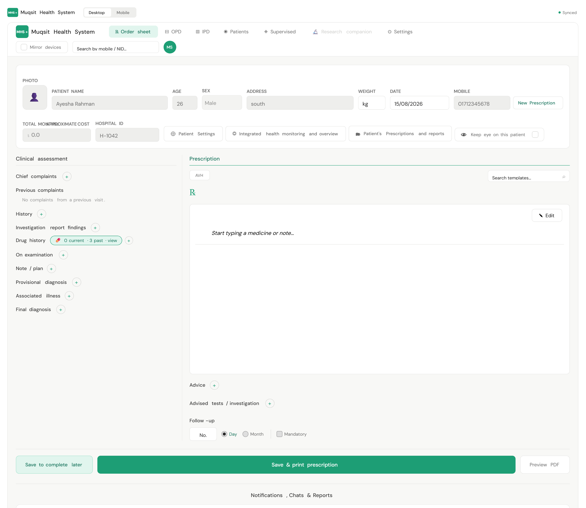
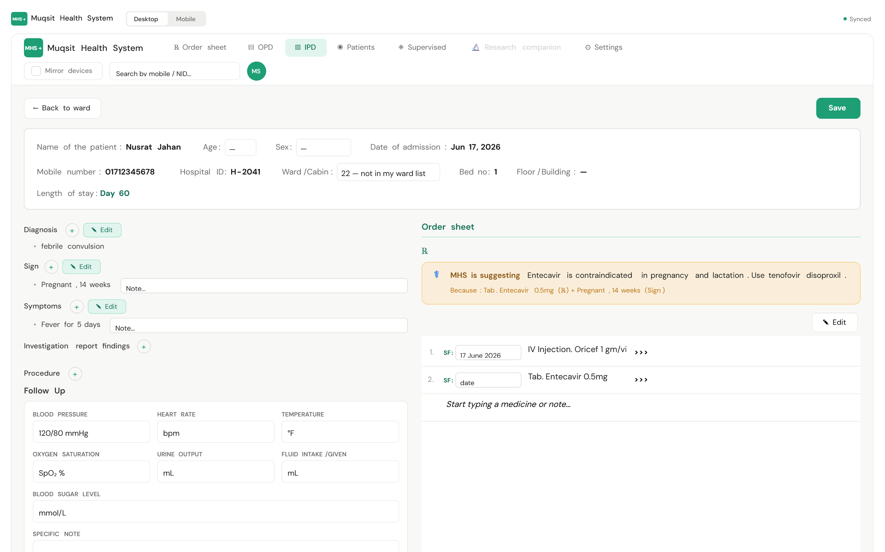
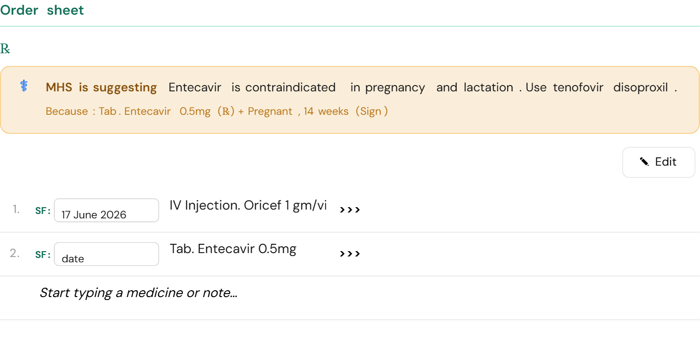
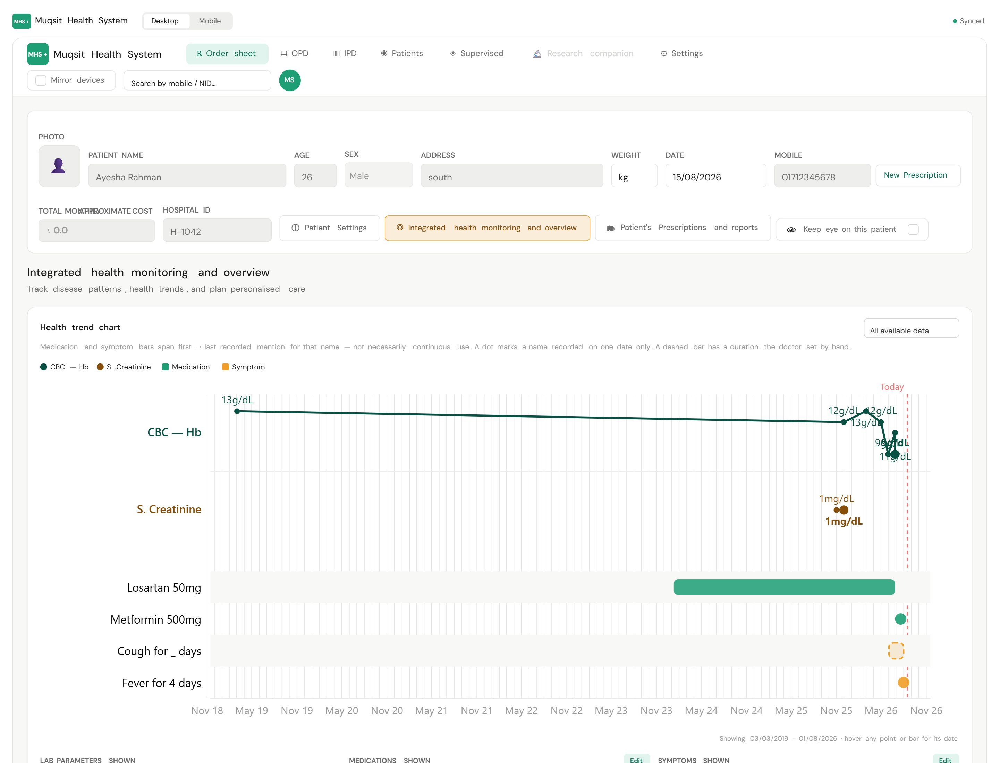
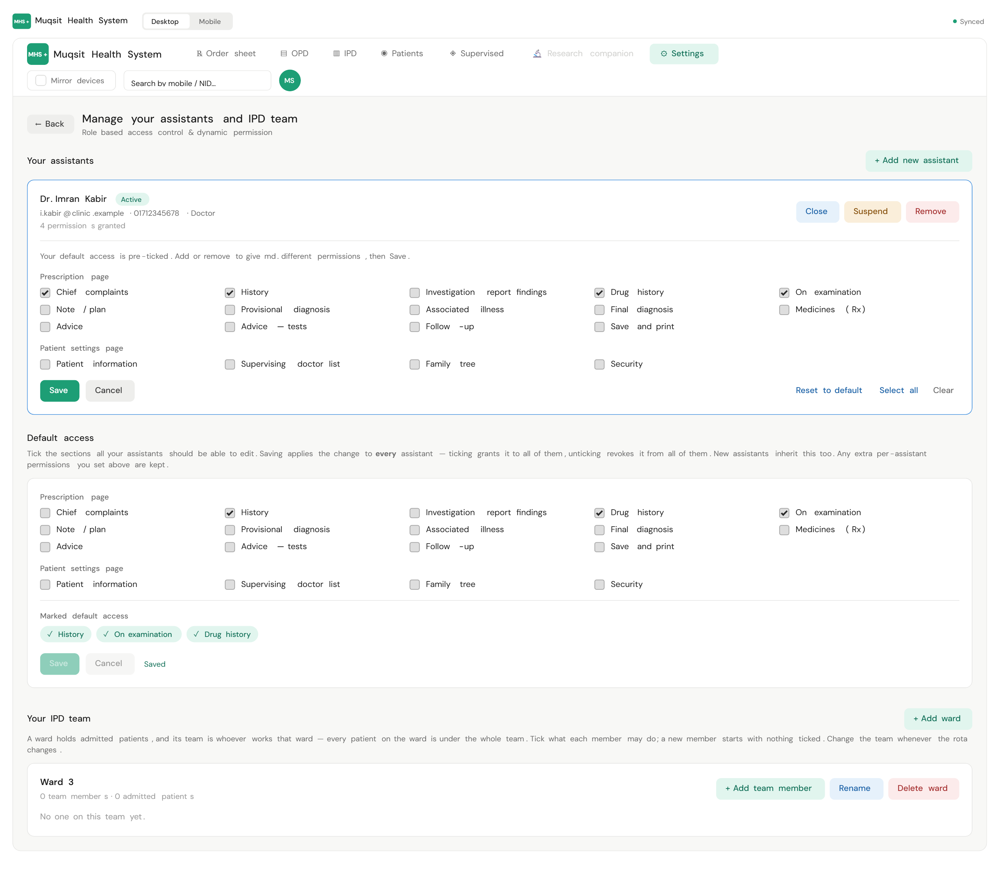
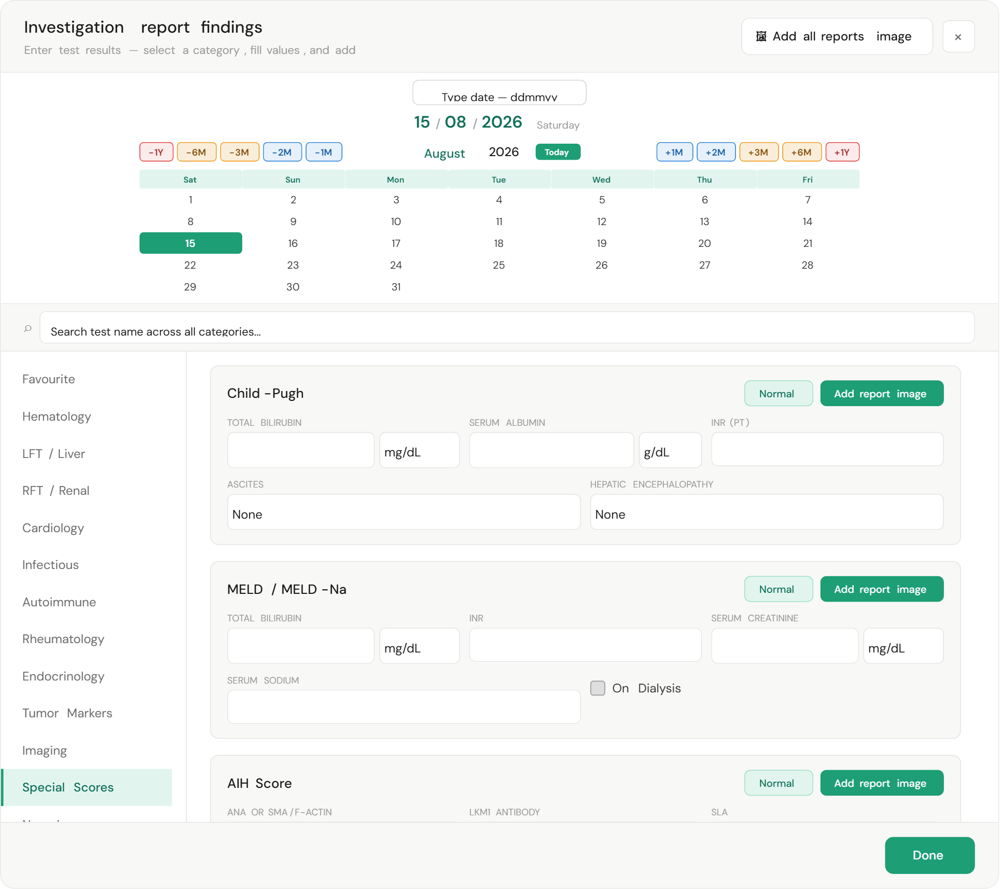
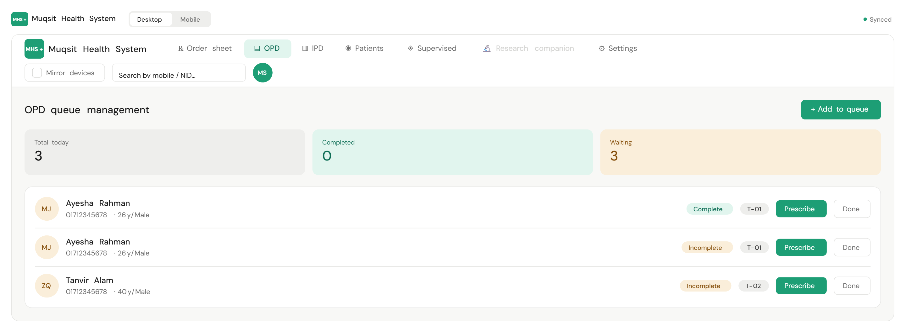

# Muqsit Health System

**A prescription and practice-management platform for doctors in Bangladesh.** Real
physicians write real prescriptions through it every day, so every feature is built to a
patient-safety-first standard: nothing clinical is guessed, nothing entered is silently
lost, and no doctor can see another practice's patients by accident.

<p>
  
  
  
  
  
  
</p>

🌐 **Live:** [muqsithealthsystem.com](https://muqsithealthsystem.com) · API at
`api.muqsithealthsystem.com/api` · admin at `admin.muqsithealthsystem.com`

---

## Screens

> Screenshots use fabricated demo names and numbers. No real patient data appears in
> this repository.

### Prescription editor

The doctor's main screen. Clinical assessment on the left, the ℞ pad on the right, and a
live prescribing-safety check above it. Everything auto-saves as a per-doctor draft, so a
reload or a dropped connection never costs a visit.



### IPD ward sheet and order sheet

Admitted patients get a ward sheet — Sign, Symptoms, investigation findings, procedures,
a timestamped vitals log — beside the order sheet the ward is run from.



### Prescribing safety check

When a drug on the pad meets a condition in the patient's chart, or another drug they are
already taking, the advisory appears while the doctor is still typing. It names the exact
lines that triggered it — that evidence line is the safety feature, because it lets the
doctor check the reason instead of trusting a banner.



### Health trends

Lab values, medications and symptoms plotted across a patient's whole history, derived from
what was actually prescribed. Derived durations understate reality, so the owning doctor can
correct a bar — and a corrected bar renders **dashed**, because "moved away from the record"
has to stay visible.



### Access control

A practice owner grants section-level permissions to assistants, and per-member permissions
to the team that works each IPD ward. Everything a doctor can do is a key someone else can
be denied.



### Investigations and clinical scores

One picker for the whole test catalogue, with 77 published clinical calculators living
beside it. Dates take the `ddmmyy` shorthand doctors actually type.



### OPD queue

The day's list with tokens, and an **Incomplete** badge on any visit that was started but
never printed — so nothing is quietly left half-written.



---

## What it does

| Area | Capability |
|---|---|
| **Prescribing** | Full editor with medicine search over a live drug table, dose/food/duration shorthand, templates, per-doctor auto-saved drafts, "save to complete later" |
| **Safety** | Drug–condition and drug–drug advisories computed live from the editor, never persisted, each one showing its own evidence |
| **OPD** | Daily queue with tokens, incomplete-visit badges, one-click resume |
| **IPD** | Ward board, admissions, bed occupancy, per-admission clinical sheet, ward teams |
| **Patients** | Mobile-first lookup, family tree with reciprocal links, supervising-doctor sharing, records, report galleries |
| **Clinical tools** | 77 published clinical calculators (scores, formulas, reference ranges) wired into the investigation flow |
| **Collaboration** | Per-patient team chat, activity/audit feed, real-time device mirroring over SSE |
| **Output** | Print/PDF prescriptions, privacy copies, image snapshots of every printed sheet |

---

## Problems worth reading about

These are the parts that were genuinely hard, and the reasoning behind them lives in the
`CLAUDE.md` files next to the code.

**Dates that lie.** `new Date("25/07/2026")` is `Invalid Date`, and `03/06/2026` silently
becomes 6 March — JavaScript reads slashes as month/day/year. Doctors here type `030626`.
Both problems are solved once, in [`lib/dateInput.ts`](client/src/lib/dateInput.ts): an
explicit `dd/mm/yyyy` parser with calendar validation, and a sliding two-digit-year window
with a **per-field policy** — a date of birth may never be in the future (`030398` is 1998,
not 2098), while a follow-up date legitimately may be. A global "never future" rule would
have been the same bug pointing backwards.

**A blank safety banner must mean "checked".** The prescribing check reads values that come
out of JSON columns and older drafts, so a field typed `string` can arrive as `null` or a
number. The matcher is therefore total: it coerces what it can, skips what it cannot, and
returns a count of unreadable values that the UI turns into a visible *"check was
incomplete"* notice. It renders inside an error boundary, because the banner lives in the
screen a doctor prescribes through and React unmounts the whole tree on a render error.

**Scoping is a safety boundary, not a filter.** Four different relationships can reach a
patient — owner, assistant working inside a practice, supervising doctor assigned to one
patient, and IPD ward team — and each sees a deliberately different slice. A supervisor
never sees the owner's prescriptions; patient deletion is owner-only, always. When the ward
team was added, the obvious implementation would have routed it through the existing
workstation resolver — and quietly handed a ward nurse the practice's entire OPD. It was
built as a separate, narrower door instead.

**A patient is not the property of a doctor.** The same person returns to a different
clinic and is found again by mobile number, so deleting a doctor's account keeps their
patients and demographics (`onDelete: SetNull`) while cascading only that doctor's own
prescriptions.

**Migrations against a live shared database.** Prisma Migrate is not used. Every schema
change ships as a hand-written idempotent SQL file (`ADD COLUMN IF NOT EXISTS …`), applied
through an SSH tunnel — 22 of them so far — because the same PostgreSQL instance serves
development and production. Only additive changes are ever allowed.

---

## Architecture

```
┌──────────────┐     ┌──────────────┐     ┌──────────────┐
│  client/     │     │  admin/      │     │  server/     │
│  Next.js 14  │     │  Next.js 14  │     │  NestJS 10   │
│  :3000       │     │  :3001       │     │  :4000       │
│  doctor app  │     │  back office │     │  REST /api   │
└──────┬───────┘     └──────┬───────┘     └──────┬───────┘
       │                    │                    │
       └────── cookie auth, X-Workstation ───────┤
                                                 │
                                        ┌────────▼────────┐
                                        │   PostgreSQL    │
                                        │   Prisma 5      │
                                        │   20 models     │
                                        └─────────────────┘
```

- **`client/`** — App Router shell, one React Query layer, a single context store for
  editor state. Inline styling against a fixed clinical palette; no UI framework.
- **`server/`** — 22 NestJS modules. Cookie JWT with rotating refresh tokens (and a 30s
  grace window so concurrent tabs don't log each other out), a workstation guard that
  resolves whose practice a request acts on, SSE fan-out for device mirroring.
- **`admin/`** — registration review and account-tier management.

**Scale:** ~31k lines of TypeScript · 191 commits · 20 data models · 77 clinical
calculators · 100 unit tests over the date, age, duration and drug-safety logic.

**Delivery:** every push to `main` builds and deploys to the VPS through GitHub Actions;
database migrations stay manual and reviewed, on purpose.

---

## Running it locally

```bash
npm run install:all      # install client, server and admin
npm run dev              # api :4000 + web :3000 + admin :3001
```

The server expects a PostgreSQL connection string in `server/.env`, and the client needs
`NEXT_PUBLIC_API_URL` in both `.env.local` and `.env.production`.

Before any commit:

```bash
npx tsc --noEmit
```

---

## Repository guide

| Path | What lives there |
|---|---|
| [`CLAUDE.md`](CLAUDE.md) | Project rules, domain vocabulary, database and deployment workflow |
| [`client/CLAUDE.md`](client/CLAUDE.md) | Editor lifecycle, date parsing traps, storage string formats |
| [`server/CLAUDE.md`](server/CLAUDE.md) | Access-control rules, auth architecture, build traps |
| `client/src/lib/calculators/` | The 77 clinical scores and formulas |
| `server/prisma/manual-*.sql` | The real migration history |

---

<sub>Built for a practising physician. Not open for redistribution.</sub>
